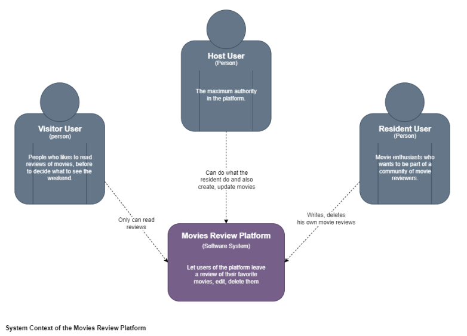

# System context

## Introduction
We decide to use the C4 model since we consider it a better way to represent the project structure. This model has 4 levels and the documentation evolves with the project documentation. 
## Level 1
In "Level 1" the most important thing is to tell the processess of the project in a way that even people outside the TI context could understand, that's why it's called "the System Context" too.

